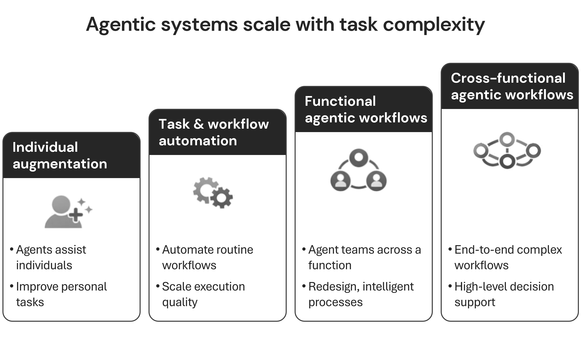

The pattern repeats across every failed AI programme. A handful of employees discover that agentic tools can compress hours of work into minutes. Their enthusiasm spreads to a team. A department runs a pilot. Results are impressive. And then nothing compounds. The organisation barely moves.

This is not a failure of ambition. It is a failure to align the transformation path with organisational maturity.

Local pilots and local initiatives are point solutions: they deliver value where they are deployed, but they do not add up to organisation-wide change. As Chapter 3 established, the people who learn to work alongside AI agents as thinking partners achieve orders-of-magnitude higher output. That kind of success can seed a pilot, and pilots can produce compelling results. The structural problem is that pilot success in one place rarely becomes reusable capability elsewhere. A win in one team or one function stays exactly there unless the organisation is deliberately built to let capability compound.

Local wins do not automatically become team capability. Team capability does not automatically become departmental transformation. And departmental wins do not automatically become organisational change.

Each tier requires different leadership. Each demands different governance. Each is measured by different indicators of success. The failure to recognise this is structural, not incidental. European leaders are underprepared for this transformation in part because they assume that investment at the top will cascade downward. It does not. Capability compounds only when the path through the tiers is chosen deliberately, based on the organisation's existing foundation.

## Why Capability Fails to Compound

Individual adoption has massively outpaced organisational readiness. This gap with the limited organisational maturity is not accidental. It is the predictable result of most leaders getting the sequence wrong: investing in enterprise-level ambitions before building the individual fluency and team-level norms on which those ambitions depend.

The evidence for bottom-up sequencing is consistent. Enterprise deployments that succeed empower power users and line managers rather than relying on centralised labs. As Chapter 1 established, the vast majority of real value comes from people, processes, and culture. This foundation is built tier by tier and cannot be installed from the top.

Failures in this space describe a similar pattern. Most AI transformations struggle to deliver measurable returns, often stalling at the pilot stage.[^38] Only a small fraction of local initiatives ever reach full production or add up to organisation-wide change. The consistent thread is either a top-down, enterprise-first approach that attempts to bypass the foundational tiers, or a proliferation of point solutions that never connect into a path that compounds.

A significant self-assessment gap compounds the problem. Many leaders believe their organisations are ready for advanced maturity, yet the reality suggests otherwise.[^39] This distance between perceived and actual readiness highlights a structural misunderstanding: leaders assume they have reached advanced stages when their organisations are still mastering the basics.

European leaders face an additional dimension. The EU AI Act, Article 4, which took effect in February 2025, makes AI literacy a legal requirement for all staff interacting with AI systems.[^40] Tier 1 is now a regulatory floor, not an optional starting point. Organisations that have underweighted individual fluency investment must now treat it as a compliance obligation as well as a strategic one.

## The Four Tiers of Transformation

The choice of path matters more than the level of ambition. A four-tier progression is the route through which AI capability typically compounds. These tiers, ranging from individual span to enterprise-wide coordination, are not a mandatory ladder. They are strategic interpretations of how maturity should advance. 

The structural mistake that explains most failure rates is not skipping a tier per se, but skipping a tier without the underlying organizational foundations to support the jump. If an organisation has mastered individual fluency and team norms, and its broader maturity allows for enterprise-scale coordination, it may intentionally choose to bypass departmental redesign and move directly to organizational transformation. This can be done successfully, provided the leadership and governance are calibrated for the target tier.

Each tier requires distinct leadership behaviour, governance, and success measures. 

### Tier 1: Individual Augmentation

This is where agentic employees are made, focusing on the individual span of control. Personal AI fluency means more than knowing how to write a prompt. It means understanding what to delegate to an AI agent, how to describe tasks effectively, how to evaluate outputs critically, and how to maintain ethical standards throughout.

Researchers have codified this through a fluency framework that focuses on the core behaviours required to work with agentic systems. This approach relies on delegation, the ability to identify which tasks should be assigned to an AI partner, and description, the skill of communicating context and requirements clearly. It further demands discernment to evaluate outputs critically rather than accepting them blindly, alongside the diligence needed to ensure that safety and ethical standards are consistently upheld.

Their finding is instructive: people who treat AI as a thinking partner, engaging in augmentative conversations, exhibit more than double the fluency behaviours of those who use it transactionally.

The organisations furthest ahead have built champion programmes to accelerate this first tier of adoption. Several large global financial institutions have successfully created vast networks of accelerators to drive widespread engagement across their global workforces. These programmes identify enthusiasts and scale their influence to the entire organisation, often within a single year, by using network analysis to find the most influential people to serve as champions of the new way of working.

One of the highest-impact, lowest-cost interventions is shared prompt libraries. Organisations using structured libraries report teams becoming 40% more productive by eliminating redundant work. More telling: organisations with these libraries achieve 85% employee AI adoption, compared to 23% where usage remains purely individual.

There is, however, a critical caution. A controlled study of 758 consultants found that whilst AI users completed 12% more tasks, finished 25% faster, and produced over 40% higher quality results, those same users were 19 percentage points less likely to produce correct solutions on tasks that fell outside AI's capability frontier.[^41] Fluency without discernment is a liability. Tier 1 must build both.

Governance at Tier 1 is light but essential: personal responsibility for data handling, the ability to recognise hallucinations, and a clear tiered approach to what is permissible. Green for low-risk experimentation, yellow for tasks requiring review, red for decisions that must remain human.

### Tier 2: Task & Workflow Automation

The transition from individual augmentation to team-based task and workflow automation is where most transformations stall. Research shows that 61% of AI use remains at the individual level without collaborative platforms.[^42] Converting personal fluency into team capability requires something technology alone cannot provide: psychological safety.

Google's research identifies psychological safety as the primary predictor of team effectiveness.[^43] Recent findings confirm this in an AI context, where the vast majority of executives see it as essential for success.[^44] Yet a significant gap remains. Many leaders do not yet view their organisations as truly safe, and many workers still fear appearing incompetent if they admit to using these tools.

As one leading researcher on psychological safety put it, AI adoption "should be treated as a team development effort, not just a technology upgrade." The practical marker of a Tier 2 team is a simple norm: "Have you asked the AI?" When that question becomes as natural as "Have you checked the data?", the team has crossed the threshold. Superusers emerge. Knowledge flows horizontally rather than vertically. The team begins to develop shared practices rather than individual workarounds.

The cost of failing to build this norm is measurable. Companies that grant explicit AI permissions see workers six times more likely to experiment. Trained workers are up to 19 times more likely to report productivity improvements.[^45] The permission signal is not a formality. It is a multiplier.

Structurally, Tier 2 benefits from a two-in-the-box model: a business lead and a technology lead co-owning the team's AI initiatives. This eliminates the common failure of technology being "thrown over the fence" to IT. Sun Life, Intel, and others have demonstrated that cross-functional teams of eight to twelve people, co-led in this way, are measurably more productive.

Middle managers are the critical enablers at this tier. They must become orchestrators of AI-human collaboration, yet only 35% of companies have structured change management programmes to support this transition.[^46]

### Tier 3: Functional Agentic Workflows

At the departmental level, functional agentic workflows shift transformation from individual tools and team norms to end-to-end redesign within a function. This is where standalone agents become multi-agent systems, and where the structural insight of agentic AI becomes visible: a human team of two to five people can supervise an "agent factory" of 50 to 100 specialised agents running an entire process.

Consider a finance workflow redesigned at Tier 3. Agent 1 extracts invoice data. Agent 2 pulls the relevant contract. Agent 3 flags discrepancies. Agent 4 drafts the resolution email. A human intervenes only at the decision point. The result: cycle times reduced by up to 80%, with improved audit trails.

In wealth management, one global firm reduced meeting preparation from two to three hours to 15 minutes by consolidating email, CRM, and portfolio data through agentic workflows. Document findability rose from 20% to 80% accessibility. Employee satisfaction increased by 22%.[^47] At Airbus, 10,000 engineers trained on AI coding tools achieved a 40% improvement in simulation cycle times.[^48] Across European organisations more broadly, industry analysis found that 56% increased profits or reduced costs through AI, with an average financial impact of over six million euros per firm.[^49]

The leap from Tier 2 to Tier 3 is where the highest proportion of initiatives die. For every 33 proofs of concept that enter production pipelines, only four emerge.[^50] The gap is not technological. It is organisational: the inability to redesign workflows, reassign authority, and restructure teams around what agentic systems make possible. Most departments add AI to existing processes rather than redesigning the process around what AI enables. The difference between those two approaches is the difference between incremental improvement and structural transformation.

### Tier 4: Cross-Functional Agentic Workflows

Cross-functional agentic workflows represent the final tier, where transformation reaches the full organisational span. This is where AI becomes embedded in the operating model itself, not as a tool used within functions but as the connective tissue between them.

At Tier 4, a demand surge in one region can trigger, within seconds, AI agents that reallocate advertising spend, adjust pricing, reroute stock, and refresh creative assets across the entire organisation. An insurer can personalise campaigns across hundreds of microsegments, producing conversion rates two to three times higher and reducing call times by 25%.[^51]

What makes this tier possible is not superior technology. It is trust, and the organisational conditions that trust requires. Digital-trust leaders are significantly more likely to achieve superior revenue and EBIT growth.[^52]

It is typical that large-scale transformations result in most organisations capturing only a fraction of their expected revenue gains and cost savings.[^53] The differentiator is rarely the level of technology investment. Organisations that prioritise cultural change alongside their technological shift achieve dramatically higher success rates than those that focus on the tools alone.

The governance architecture at Tier 4 typically evolves through three phases. A centralised Centre of Excellence provides strong governance during the first 12 months. This transitions to a hub-and-spoke model, with central standards and distributed execution, between 12 and 24 months. Finally, a federated structure emerges: autonomous pods with shared governance, from 24 to 36 months onward.

Roughly 37% of large companies have established some form of Centre of Excellence;[^54] but is it evolving or becoming a bottleneck?

The enterprise measure at this tier is not an AI metric. It is a business outcome: revenue growth, margin expansion, customer experience, speed to market. AI is the means. The organisation's strategic objectives are the measure.

## What Leaders Must Do at Each Tier

The four tiers create four distinct governance demands. Applying the same leadership approach across all of them is one of the most common and costly mistakes.

**At Tier 1, the leader's role is visibility.** As established in previous chapters, leaders deeply engaged with AI are far more likely to be among the top-performing companies. Only a small minority qualify as "trailblazers." The single most powerful signal a leader can send at this stage is personal, visible use of AI: modelling experimentation, sharing what works and what does not, and explicitly signalling that experimentation is safe.

**At Tier 2, the leader's role shifts to connector.** This means linking early adopters across teams, creating the conditions for horizontal knowledge flow, and keeping governance light enough that emerging norms are not crushed by premature standardisation. Middle managers require explicit support and structured change management to become the orchestrators this tier demands.

**At Tier 3, the leader becomes strategist and governor.** Department-level workflow redesign requires investment approval, cross-department coordination, and the willingness to let functions redesign how work is done rather than simply adding AI to existing processes. The fact that only a subset of AI initiatives advance beyond pilot reflects, in most cases, a governance failure at this tier: leaders who approve pilots but do not create the conditions for production deployment.

**At Tier 4, the leader is architect.** 

Operating model redesign, AI as corporate strategy, and enterprise-wide coordination require active executive sponsorship. Research shows that firms with active sponsors are significantly more likely to scale AI effectively.[^55] This is a design role rather than a figurehead position. Leaders must decide which functions integrate, how data flows across boundaries, and where the operating model creates unique competitive advantage.

### The European Advantage

European leaders often view regulation as a constraint on pace. The evidence suggests the opposite.

The EU AI Act's mandatory AI literacy requirement accelerates Tier 1 by providing budget justification and strategic urgency for the individual fluency investment that most organisations underweight. Works council consultation, far from slowing Tier 2, builds the trust and psychological safety that research identifies as the single strongest predictor of team effectiveness. GDPR's human-in-the-loop requirements enforce the governance guardrails that prevent Tier 3 and Tier 4 failures from cascading.

In Germany, works councils have co-determination rights over AI-related monitoring technology, and leading companies including Siemens and Deutsche Telekom have negotiated agile company agreements that enable AI deployment within a framework of employee trust. In France, even pilot deployments require prior works council consultation. In the Nordics, Norway has formalised a "data shop steward" role. These are not obstacles. They are structural accelerators for the trust that makes transformation compound.

### Three Critical Mistakes

Three patterns consistently undermine tier-by-tier progress.

Over-investing in Tier 4 before Tiers 1 and 2 are in place is the first. Enterprise steering committees, platforms, and strategy are necessary, but they cannot function without a foundation of individual fluency and team-level norms. The organisation that builds the roof before the walls has an expensive structure that cannot stand.

Applying the same governance to all tiers is the second. Light-touch governance that works for individual experimentation is insufficient for departmental workflow redesign. Rigorous governance designed for enterprise deployment will suffocate early-stage adoption. Each tier requires governance calibrated to its risk profile and maturity.

Ignoring skill creation and sharing is the third. As Chapter 3 introduced, a skill is a reusable AI workflow. When people create skills but do not share them, local wins stay local, the organisation loses its most powerful compounding mechanism. Shared skills are how Tier 1 fluency becomes Tier 2 capability, and how Tier 2 capability becomes Tier 3 workflow redesign.

## The Path is a Strategic Choice

The evidence is structural, and it is consistent. Transformation typically scales from individuals to teams to departments to the organisation as a whole, and each tier demands a different kind of leadership. However, this is not a rigid trajectory. Organisations with high legacy maturity in data, trust, and cross-functional coordination can choose to skip tiers to accelerate their strategy.

The risk is not the skip itself, but the collapse that follows when Tier 4 ambitions are attempted on Tier 1 foundations. Organisations that map their path through the tiers based on real capability, rather than hopeful ambition, are the ones that reach the small minority who achieve AI value at scale.

The tiers are a structural reality: they describe the layers of capability required. Whether an organisation moves through them one by one or jumps between them is a strategic decision that depends on the strength of the foundation they have already built.

[^38]: BCG, "The Widening AI Value Gap", October 2025 — https://media-publications.bcg.com/The-Widening-AI-Value-Gap-October-2025.pdf
[^39]: Huble, "The AI Data Readiness Report", 2025 — https://huble.com/ai-data-readiness-report
[^40]: EU, "Regulation (EU) 2024/1689 (AI Act)", OJ L 2024 — https://eur-lex.europa.eu/eli/reg/2024/1689/oj
[^41]: Dell'Acqua et al., "Navigating the Jagged Technological Frontier: Field Experimental Evidence of the Effects of AI on Knowledge Worker Productivity and Quality", Harvard Business School Working Paper 24-013 / BCG, 2023 — https://www.hbs.edu/faculty/Pages/item.aspx?num=64700
[^42]: Typeface, "The Signal Report: The State of AI in Marketing", 2025 — https://www.typeface.ai/
[^43]: Google re:Work, "The five keys to a successful Google team" (Project Aristotle), 2015–2016 — https://rework.withgoogle.com/guides/understanding-team-effectiveness/
[^44]: MIT Technology Review Insights / Infosys, "Creating psychological safety in the AI era" (survey), December 2025 — https://www.infosys.com/newsroom/press-releases/2025/psychological-safety-driving-ai-initiatives.html
[^45]: Slack / Global Survey, "Workforce Index" (regional editions), 2024 — https://slack.com/intl/en-gb/blog/news/the-slack-workforce-index
[^46]: BearingPoint, "AI Adoption in the Enterprise: European Survey", 2025 — https://www.bearingpoint.com/en/our-success/insights/
[^47]: Kore.ai, "AI for Work: Agentic wealth management case study" (customer implementation), 2025 — https://www.kore.ai/
[^48]: GitHub, "Airbus scales development with GitHub Copilot" (customer story), 2024 — https://github.com/customer-stories/airbus
[^49]: EY, "European AI Barometer", 2025 — https://www.ey.com/en_gl/insights/artificial-intelligence
[^50]: IDC, "AI implementation and project deployment survey" (market analysis), 2024 — https://www.idc.com/
[^51]: McKinsey, "Agents for growth: How AI agents are reshaping customer engagement and work", November 2025 — https://www.mckinsey.com/capabilities/quantumblack/our-insights
[^52]: McKinsey, "Why digital trust truly matters", September 2022 — https://www.mckinsey.com/capabilities/risk-and-resilience/our-insights/why-digital-trust-truly-matters
[^53]: McKinsey, "Rewired: The McKinsey guide to outcompeting in the age of digital and AI", 2023 — https://www.mckinsey.com/featured-insights/mckinsey-on-books/rewired
[^54]: BCG, "Winning with AI is a people game" (AI CoE / scaling research), 2024 — https://www.bcg.com/publications/2024
[^55]: BCG, "AI Radar 2026: As AI investments surge, CEOs take the lead", January 2026 — https://www.bcg.com/press/15january2026-as-ai-investments-surge-ceos-take-lead

## Questions for the Board

1. At which tier does the majority of your organisation's AI activity actually sit today, and are you intentionally skipping any tiers to accelerate your strategy?
2. If you are skipping a tier (e.g., moving from Task & Workflow Automation to Cross-functional Agentic Workflows), what specific organizational maturity foundations are you relying on to bridge that gap safely?
3. Have you invested in enterprise-level AI before achieving measurable individual augmentation and team-level psychological safety? If yes, how are you ensuring the foundation is strong enough to support the jump?
4. What specific leadership behaviour have you or your leadership team adopted at each tier (visible use at Tier 1, connector at Tier 2, strategist at Tier 3, architect at Tier 4)?
5. Does your governance differ by tier, for example light-touch for individual augmentation versus rigorous for functional agentic workflows, or is it one-size-fits-all?
6. How are you measuring success at each tier (e.g. adoption rates at Tier 1, team norms and throughput at Tier 2, workflow cycle times at Tier 3, enterprise KPIs at Tier 4)?

## Case Study: ING: The Bank That Sequenced Before It Scaled

### Building on a Decade of Digital Transformation

ING did not enter the generative AI era as a blank slate. A decade earlier it had already learned what it feels like to modernise a large bank when the methods are new and the outcomes are initially hard to narrate. When ING introduced agile ways of working at scale, alongside product management and design-led approaches, it had to rewire governance, decision rights, and delivery rhythms long before the market could see a single clean “launch moment.”

That experience matters, because it left ING with a practical instinct for sequencing. Rather than treating AI as a single enterprise rollout, the bank approached it as another operating-model shift: build capability where the work happens, let new norms take root in teams, and only then scale what proves repeatable. The lesson from the earlier transformation was simple: compounding requires discipline more than declarations.

ING chose to sequence before it scaled. That choice is the reason its numbers look different from most of its peers.

### Capitalising on a Five-Hundred-Strong Analytical Foundation

Several factors shaped the environment in which ING made this call.

The macro backdrop was unhelpful to patience. The 2023 wave of generative AI created intense pressure on every financial institution to demonstrate AI ambition. Fintechs and digital challengers were moving quickly. Peer banks were making announcements. The investor and analyst community was paying attention to AI strategy in a way it had not before.

Inside ING, the starting conditions were more favourable than most. The bank had already sustained serious investment in analytics capability: a 500-strong analytics team that represented years of deliberate institutional commitment rather than reactive hiring. That foundation mattered. It meant ING entered the generative AI era with a data culture already in place, domain expertise already documented, and a critical mass of people who understood what rigorous analysis looked like.

The Netherlands context added two further factors. Dutch GDPR compliance standards and the emerging EU AI Act shaped how ING approached data governance and staff obligations. And the Netherlands' strong works council culture meant that workforce engagement was not optional, it was structural. Any programme that could not withstand that scrutiny would not survive.

ING's position as the largest mortgage provider in Europe added another dimension. Mortgage origination, underwriting, and customer management involve complex domain knowledge that takes years to develop. As Bahadir Yilmaz, ING's Chief Analytics Officer, put it, "We have domain knowledge that can be transferred into digital workflows, supported by AI." That knowledge transfer only works if the individuals who hold the domain expertise are fluent enough at the individual level to participate in the redesign of the workflows that encode it.

### The Short-term Costs of Long-term Stability

Choosing the sequenced path carried real costs.

Speed to visible enterprise results was the most immediate sacrifice. Competitors announced grander transformation programmes faster. Enterprise-first rollouts generate press releases, analyst briefings, and board presentations in a way that tier-by-tier capability building does not. ING's approach was quieter and harder to narrate externally.

Market signalling was a related cost. An enterprise AI platform, announced with appropriate fanfare, is straightforward to communicate to investors. A deliberate, function-by-function capability build is not. The story requires patience from the audience.

Governance burden was also higher in the short term. Managing a sequenced transformation means the executive team must hold a process accountable rather than mark a launch as complete. That requires more sustained attention over a longer period, without the clean milestone that a single enterprise rollout provides.

Some use cases moved more slowly than they might have in a less disciplined environment. The sequenced approach means that departmental workflow redesign waits for team-level capability to be genuinely in place, which waits for individual fluency to be genuinely in place. That sequencing has a cost in elapsed time, even when it reduces the cost of failure.

These were real trade-offs. ING made them deliberately, and the outcome data is the only honest measure of whether that discipline was justified.

### Why Sequencing Delivers Seven Times the Industry Production Rate

The headline number is the pilot-to-production rate: 90%, against an industry average of roughly 30%. For context, research puts the broader average at 10-25%. ING's rate is therefore three times the industry average and roughly seven times the IDC baseline.

That gap does not happen by accident. It reflects a structural difference in how the organisation builds. Pilots that emerge from genuine team-level adoption, within functions whose workflows have been deliberately redesigned, have a different production profile from pilots launched centrally in search of scale before the foundation is ready.

The operational outcomes reflect the same sequenced build. Seventy-five per cent of customer queries are now handled by AI chatbots, a Tier 3 outcome: end-to-end workflow redesign within the customer service function. Productivity in operations increased by 25% when AI was introduced, a result that sits at the Tier 2 and Tier 3 boundary: teams with genuine AI adoption norms embedded in redesigned workflows.

### How Maturity Becomes a Strategic Accelerator

ING's pattern maps directly onto the Four Tiers of Transformation, but the lesson for European organisations is not about a rigid ladder. It is about the relationship between sequence and maturity.

The bank's 90% pilot-to-production rate reveals a deliberate alignment of strategy with capability. When individual augmentation is real and team norms are established, an organisation can decide how far to reach. For ING, the path was largely sequential, following the span from team-level automation to functional workflows, but the transferrable lesson for others is that the path through the tiers is a choice enabled by the foundation.

When foundations are ignored, even a well-designed pilot has nowhere to go. It succeeds in isolation and stalls because the organisation lacked the maturity to support that specific tier of transformation.

For a European organisation, ING's lesson is this: the governance burden and the elapsed time of transformation are not inefficiencies to be engineered away. They are the mechanism by which transformation actually compounds. Whether an organisation builds sequentially or skips tiers, it must do so with results that reflect a production rate and an operating model genuinely ready for the future.
