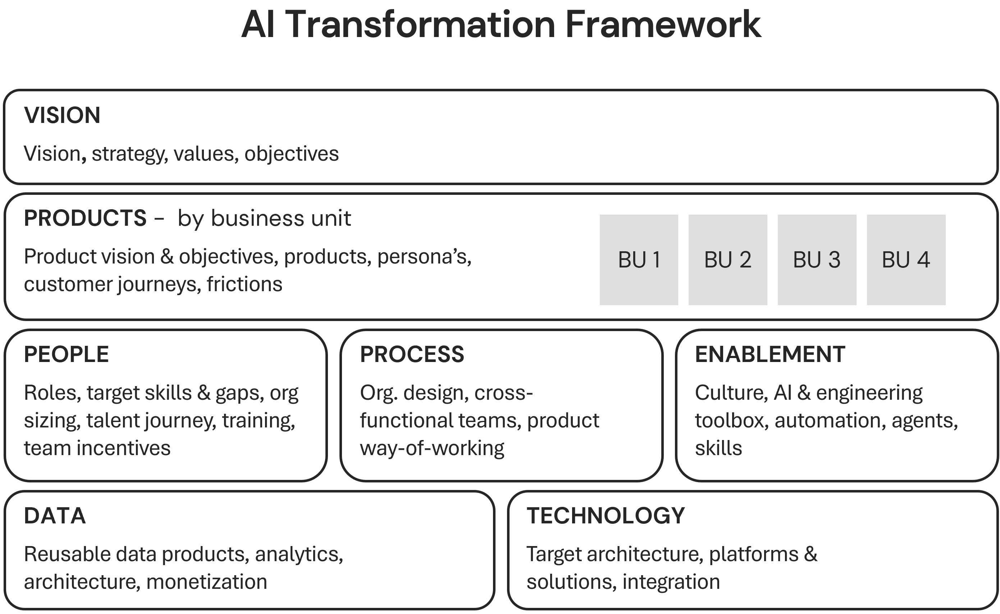

## Every Transformation Needs a Map

Every transformation needs a map. Without one, pilots scatter, investments fragment, and the board has no shared language for where the organisation is and what it must build. The Four Tiers from Chapter 4 and the playbook in later chapters need a common structure. That structure is the AI Transformation Framework: four layers that every organisation must address, from the top (Vision, strategy, values, objectives) to the bottom (Foundation: data, technology, enablement).

This chapter introduces the full framework. It walks through each layer briefly so you know what each means and where the rest of the book goes deeper. 

## Why a Single Framework Matters

Scattered initiatives fail because there is no shared model of what the organisation is building. Industry surveys consistently show a wide gap between adoption and tangible impact. Large majorities of firms use generative AI, yet only a small fraction report significant bottom-line benefit.[^56] Most organisations struggle to move past the pilot stage to achieve enterprise-wide value and measurable returns.

The gap between pilot and production is where value dies. Industry analysis often shows that the vast majority of use cases that could deliver real impact remain stuck in pilot. Without a shared map, they rarely graduate to scale. These pilots are typical "point solutions", local successes that demonstrate potential but, if not guided by an overall framework, fail to integrate into the broader business. 

An AI transformation is only complete if all the pillars of the framework are covered. Focusing on just one or two layers is a recipe for stagnation. For example, a heavy investment in the Foundation (data and tech) will not yield results if the Operating Model (people and process) remains unchanged. To achieve the full effect of the transformation, each of the pillars is necessary to support the others; Vision provides the target, Products provide the value, the Operating Model provides the execution, and the Foundation provides the capability.

The cause of failure is rarely technology itself. A large share of deployment effort is consumed by unglamorous work like data engineering and workflow integration.[^57] Only a small minority of organisations globally possess truly AI-ready data.[^58] Research shows that while workflow redesign has the strongest correlation with financial impact, very few firms have fundamentally redesigned how work is done.[^59]

The problem is the absence of a coherent, multi-dimensional model. The framework gives the board and C-suite a shared vocabulary. It is the basis for asking, on each layer, "Where are we, and where do we need to be?" Success requires building these pillars in concert, ensuring they reinforce each other rather than standing as isolated efforts.

## The AI Transformation Framework

The AI Transformation Framework is the map for the Agentic Organisation. It has four layers, top to bottom, as shown in the figure below. Each layer must be addressed; skipping one creates blind spots and limits how far transformation can scale.

**Layer 1: Vision.** Vision, strategy, values, and objectives sit at the top. This is the strategic direction: where the organisation is heading and why. Leadership sets it (Chapter 2). Chapter 4 connects Vision to the top of the framework and to the Four Tiers.

**Layer 2: Products.** This layer is organised by platform or business unit. It covers product vision and objectives, products, personas, customer journeys, and frictions. In an Agentic Organisation, products become AI-native and customer journeys dynamic and adaptive, including concepts such as zero-click discovery. Where you play and how you win in each segment depends on this layer. Later chapters go deeper by business unit.

**Layer 3: Operating Model.** This is where strategy becomes structure. It has three dimensions: 
_People:_ roles, target skills and gaps, org sizing, talent journey, training, and team incentives. The agentic employee (Chapter 3) sits here: orchestrating agents, with the three profiles of supervisor, specialist, and augmented frontline worker. 
_Process:_ org design, cross-functional teams, and product way-of-working. Transformation demands end-to-end workflow redesign around human–agent collaboration. 
_Enablement:_ culture, the AI and engineering toolbox, and the organisational capacity to stimulate and absorb change. Enablement ensures that change can be driven bottom-up as well as top-down: employees understand AI, adopt an orchestrator mindset, and contribute as agentic employees; management participates and models the behaviour. 

**Layer 4: Foundation.** The base of the framework has three pillars. 
_Data:_ reusable data products, analytics, architecture, and monetisation; data as a strategic asset. 
_Technology:_ target architecture, platforms and solutions, integration; including protocols such as MCP and agent standards.

> **Definition: The AI Transformation Framework**
>
> The AI Transformation Framework is the map for the Agentic Organisation.

## The Framework as a Governance Instrument

The framework is the basis for board and C-suite conversations. The right question for every layer is where the organisation currently sits and where it needs to be. Governance demands span all four layers rather than just technology. Active research suggests that most boards report limited AI knowledge and very few receive regular AI-related metrics.[^60] Applying the framework allows the board to assess transformation progress across every dimension.

To govern effectively, the board should apply three lenses to each layer and pillar of the framework: efficiency, effectiveness, and risk. These are not general abstractions; each can be specifically defined, measured, and improved at every level of the transformation map.

### 1. Efficiency: Doing Things Right
Efficiency is about the speed, cost, and friction of the transformation. It measures how well resources are being converted into progress.
*   _Vision:_ Measuring the "time-to-strategy." How quickly can leadership adjust objectives based on technological shifts? Efficiency here is defined by decision-making velocity.
*   _Products:_ Throughput and development cost. How efficiently are AI-native products moving from concept to customer? Measuring the unit cost of AI features provides a baseline for improvement.
*   _Operating Model:_ The degree of automation within internal processes. Efficiency is measured by the reduction in manual cycles for standard tasks. Improving this means redesigning workflows so that agents handle the volume whilst humans provide the direction.
*   _Foundation:_ Data reuse and technology consolidation. Efficiency is defined by how many products can share the same underlying data assets without rebuilds. Effectiveness at the foundation is measured by the reduction in technical debt and the speed of integration via standards like the Model Context Protocol (MCP).

### 2. Effectiveness: Doing the Right Things
Effectiveness measures whether the transformation is actually delivering the intended strategic value and outcomes.
*   _Vision:_ Strategic alignment. Is the AI roadmap actually supporting the core mission of the organisation? Effectiveness is measured by the correlation between AI initiatives and top-level KPIs.
*   _Products:_ Impact on the customer journey. Effectiveness is defined by the reduction in customer friction, such as moving from multi-click search to zero-click discovery. Improvement is seen in increased customer lifetime value and lower churn.
*   _Operating Model:_ Skill adoption and shift in roles. Effectiveness is measured by the percentage of the workforce successfully transitioning to "orchestrator" roles. It is not just about training but about the tangible shift in output quality from human–agent teams.
*   _Foundation:_ Data quality and system reliability. Effectiveness is defined by the accuracy and relevance of the data fed into agentic systems. Improvement is measured by the decline in "hallucination" rates or errors in automated decision-making.

### 3. Risk: Managing the Downside
Risk governance ensures that the transformation does not create unacceptable exposure to the organisation.
*   _Vision:_ Reputational and ethical risk. Are the AI objectives aligned with the organisation's values? Risk is defined by the clarity of the ethical guidelines and measured by compliance with them.
*   _Products:_ Bias and product safety. As products become dynamic and adaptive, the risk of unpredictable behaviour increases. Measuring and improving the safety boundaries within the product layer is a critical board responsibility.
*   _Operating Model:_ Oversight and the "Human-in-the-loop" (HITL). Risk is defined by the potential for autonomous systems to act without sufficient human oversight. It is measured by the robustness of governance protocols governing agentic actions.
*   _Foundation:_ Security, privacy, and technical robustness. This includes managing "shadow AI" and ensuring data privacy. Improvement is measured by the reduction in unauthorised tool usage and the strength of the security posture around proprietary models.

By breaking down the transformation into these four layers and three dimensions, the board moves from vague enthusiasm to rigorous governance. Every initiative can be plotted: is it an efficiency play in the Foundation layer, or an effectiveness play in the Products layer? Is the risk being managed in the Operating Model through new roles and oversight? This structured view ensures that the transformation is balanced, measurable, and steered with clarity.

## From Map to Execution

The AI Transformation Framework provides the map. The next question is how to organise the organisation for agentic work: roles, skills, team design, and the Operating Model layer that connects vision to day-to-day execution. Chapter 7 deep-dives the Operating Model: people, process, roles, skills, and org design, and how to structure teams and roles for agentic work, from task-doer to orchestrator at scale. The framework orients; the Operating Model layer is where strategy becomes structure and where many organisations bottleneck after successful pilots.

[^56]: BCG, "The Widening AI Value Gap", October 2025
[^57]: Deloitte, "Tech Trends 2025", 2025
[^58]: Capgemini Research Institute, "AI Agents in the Enterprise", 2025
[^59]: McKinsey, "Rewired", 2023
[^60]: McKinsey, "State of AI", 2025

## Questions for the Board

1. Can your leadership team define where the organisation stands on each of the four layers (Vision, Products, Operating Model, Foundation), and do you treat them as interdependent pillars that must be built in concert?
2. Looking at your current portfolio, how many initiatives are isolated "point solutions"—pilots that lack a path to scale because they are not supported by the other layers?
3. Does your board receive metrics that measure progress across all three dimensions of efficiency, effectiveness, and risk, for each of the four layers of the framework?
4. Which of the three dimensions is your current blind spot? For example, are you chasing efficiency in the Foundation whilst neglecting effectiveness in the Products layer or risk in the Operating Model?
5. How is your board using the framework to turn strategy into structure, ensuring that every layer from Vision to Foundation is explicitly addressed and governed?

## Case Study: BBVA, Deploying One AI Transformation Map Across 120,000 Employees

### Local Speed vs. Enterprise Coherence

BBVA faced a classic scale problem with an unusual twist: how to deploy a single, enterprise-wide AI transformation map across 120,000 employees in 25 countries without it collapsing into scattered pilots or one-size-fits-none mandates. The dilemma was not whether to adopt AI, but how to make one coherent framework the organising principle for the whole organisation. One path was to let business units and countries move at their own speed with local tools and priorities; the other was to bet on a unified vision, a central platform (ChatGPT Enterprise via a strategic alliance with OpenAI), and a shared structure that could be adapted locally. Both paths had real costs: fragmentation versus the risk of top-down rigidity and the heavy investment required to align 25 countries under one map.

### Scaling Central Capability via Embedded Expertise

BBVA had already gone through digital and mobile transformation at scale. Leadership, including Chair Carlos Torres Vila, framed the next step as entering the AI era "with even greater ambition." That meant treating AI not as a set of isolated initiatives but as a transformation that had to be mapped and governed across the full organisation. The bank operated in 25 countries with different regulatory environments, languages, and maturity levels. A single framework had to work as the shared vocabulary for the board and C-suite whilst allowing local execution. Industry evidence was sobering: the majority of use cases that could deliver real impact stay stuck in pilot, and only a small fraction of firms achieve enterprise-wide AI at scale. BBVA chose to invest in a central "AI Factory" of over 400 professionals and to embed 300 "AI wizards" in business units, tying central capability to distributed ownership.

### Choosing Consistency Over Fragmentation

- **Centralised platform choice:** Committing to ChatGPT Enterprise and a strategic alliance with OpenAI meant less flexibility to mix and match best-of-breed tools by country or function; the organisation traded optionality for consistency and speed of rollout.
- **Resource concentration:** The AI Factory (400+ professionals) and 300 embedded wizards represent a large, sustained investment in central and semi-central roles; that capacity was not available for other strategic priorities.
- **Standardisation pressure:** One map across 25 countries risked under-serving local needs or forcing a single tempo where some markets were not ready; the bank accepted that some local initiatives would be delayed or reframed to fit the framework.
- **Governance and dependency:** Aligning all four layers (Vision, Products, Operating Model, Foundation) under one vision required continuous coordination and governance; the organisation took on the cost of that coordination rather than allowing siloed progress.
- **Expectation management:** Setting "even greater ambition" than digital and mobile raised the bar internally and externally; falling short would be more visible than under-promising.

### Productivity Gains and the Rise of Local Innovation

The outcome so far is strong adoption and early productivity signals. Around 80% of employees engage with the platform daily, and employees report saving roughly three hours per week on average. Over 3,000 custom bots have been created, indicating that the map and enablement layer are being used not only for standard workflows but for local and team-level use cases.

The structure (AI Factory plus embedded wizards) illustrates how the four layers of the AI Transformation Framework were addressed in practice: a clear vision from the top, product and journey implications, an operating model that combines central capability with embedded roles, and a foundation that includes technology (ChatGPT Enterprise), data, and enablement (wizards, training, culture). The result is not a finished transformation but a working example of one coherent map applied at scale across a large, multinational bank.

### The Map as an Instrument of Governance

Leadership teams can take one clear lesson from BBVA: the AI Transformation Framework works as a governance and organising principle only when it is used as the single map for "where we are and where we need to be" on every layer. Letting Vision, Products, Operating Model, and Foundation evolve separately leads to the pattern the chapter describes: pilots that do not scale and boards that lack a shared language.

BBVA's bet was to make the framework the basis for investment, roles, and prioritisation across their global operations, not a checklist to be filled in once. The transferable rule is to adopt one framework, use it to assess and govern all four layers, and accept the trade-offs (central platform choices, coordination cost, standardisation) in exchange for a transformation that can be measured, steered, and scaled as a whole.

## Handoff — Reviewers — Chapter 05
Status: complete
Output: output/chapters/chapter-05/ch05-final.md
Review report: output/chapters/chapter-05/ch05-review.md
Style: PASS
Character: PASS
Continuity: PASS
Footnotes log: confirmed present
Escalations: none
Chapter status: DONE
