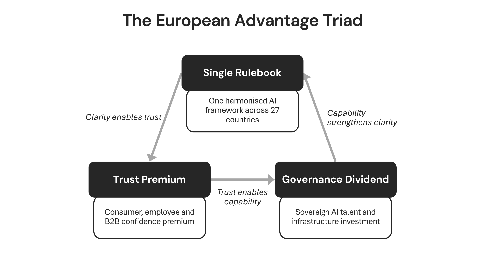

## Europe's Distinctive Edge

When European CEOs apologize for their regulation, they frame it as a constraint: slower, more cautious, more expensive to navigate than their American or Asian counterparts. But it can be an opportunity, if they choose to see it that way.

Europe's regulatory rigour, its culture of trust, and its pragmatic approach to technology adoption are not handicaps in the race to build the Agentic Organisation. They are, in the hands of a leader who understands them, a structural competitive advantage. The question is not whether European regulation slows you down, but whether you are using it to build something your less-regulated competitors cannot easily replicate.

Historically, European AI venture capital has trailed significantly behind the United States, with American companies often outspending their European counterparts by a wide margin across most sectors.[^93] By almost any measure of capital and infrastructure, Europe appears to be in a position of catch-up.

But there is a second set of numbers that rarely features in the boardroom conversation. A clear majority of global adults trust the EU to regulate AI effectively, showing significantly more confidence in the European approach than in those of the US or China.[^94] Meanwhile, public trust in fully autonomous AI agents has seen a sharp decline in a very short period.

Over half of European generative AI users believe adoption would increase with proper government regulation.[^95] The commercial premium for demonstrably trustworthy AI keeps growing.

This chapter goed deeper into these three structural advantages the European Advantage Triad: The Single Rulebook, The Trust Premium, The Governance Dividend. Regulation and culture create them for leaders willing to convert compliance into competitive edge. The triad builds on the Trust element of the AI Decision Framework (Chapter 9) and anchors it in Europe's distinctive regulatory and cultural context.

**The Single Rulebook** is the strategic benefit of one harmonised AI framework across 27 countries. **The Trust Premium** is the commercial advantage that demonstrable compliance, consumer confidence, and workforce acceptance create. **The Governance Dividend** is the operational strength that compliance processes build: data quality, governance maturity, and documentation discipline. Each advantage reinforces the others: the single rulebook enables the trust premium, the trust premium enables the governance dividend, and the governance dividend justifies the clarity of the rules.

## The Perception Gap

The frustration is real and it comes from the top. Siemens CEO Roland Busch called the AI Act "a key reason Europe is lagging" and described the Data Act as "toxic". SAP CEO Christian Klein wants "much less regulation" and "a united Europe". Capgemini CEO Aiman Ezzat said the EU went "too far" with AI rules.

Forty-six European technology leaders wrote to the European Commission requesting a two-year delay to the AI Act's high-risk provisions. These are not unreasonable voices. They lead companies that compete globally, and they feel the weight of regulatory complexity in their operating costs and speed to market.

Yet even the critics are hedging. Busch refused to sign the 46-CEO delay letter, arguing it did not go far enough, yet signed the EU AI Pact and now positions regulation as "driving innovation" for digital product passports. SAP achieved ISO 42001 certification. The gap between public rhetoric and private action suggests that European leaders understand the advantage even as they complain about the cost.

The Mittelstand tells a quieter version of the same story. A significant portion of German mid-market firms now use AI in some capacity, yet average spending as a percentage of revenue has slightly softened. Only a minority of these companies have a formal AI strategy in place, reflecting a pattern of caution rather than conviction among small and medium enterprises.

The honest caveat deserves stating plainly. Europe's AI investment gap is stark, and regulation alone does not close it. The gap is in capital and infrastructure, not in the quality of what European companies build when they do invest. The pattern among high-performing AI organisations consistently points to governance discipline, not spending volume, as the differentiator.

The small group of European firms classified as "AI Achievers" generate substantially greater revenue growth than their peers.[^96] They are the ones designing AI responsibly from the start, building governance into their programmes from the very beginning.

The key is to convert regulation into competitive advantage.

## The European Advantage Triad

Each of the three advantages has a clear evidence base, already visible in the companies, markets, and regulatory dynamics that define European AI today.

**The Single Rulebook.** The EU AI Act provides one harmonised framework across 27 member states. In the United States, over 30 states have introduced or are actively considering AI-specific legislation with conflicting definitions, thresholds, and enforcement mechanisms. Colorado, California, Texas, and Illinois each take different approaches. A European company navigating this landscape faces one rulebook. An American competitor faces dozens.

As Graham Abell, Vice President Public Policy at Workday described it, the EU framework is "actually really beneficial because it provides the rules of the road on how to engage", whilst the US approach creates "a really uneven playing field".

The Brussels Effect extends the single-rulebook advantage beyond European borders. Microsoft, Google, Amazon and over 23 other general-purpose AI providers have signed the EU's Code of Practice. UK firms are drifting "towards the highest standard of AI regulation", making the EU AI Act a de facto global baseline. For a company that masters one set of rules, the reward is a governance architecture that scales across markets.

**The Trust Premium.** Research shows that a majority of consumers would pay a premium for AI tools that can guarantee data safety. Furthermore, most users now express a preference for stricter rules regarding safety and fairness.[^97] As trust in autonomous agents declines, the commercial value of being demonstrably trustworthy is only increasing.

The trust advantage extends to the workforce. Employees who feel secure about their future in an AI-augmented workplace are significantly more likely to embrace the technology. Conversely, a large majority of workers in major economies remain sceptical, with many believing their leaders are not being entirely transparent about the impact on jobs.[^98]

Employers remain the most trusted institution on this topic, which gives organisational leaders a powerful lever.

European social dialogue, including works councils and collective bargaining, builds the workforce acceptance that determines whether AI delivers value or remains stuck in pilot. Microsoft found that works council feedback on Copilot in Germany anticipated customer concerns before they surfaced externally. This is not resistance. It is product intelligence.

Large-scale surveys across Europe consistently show that a majority of generative AI users believe adoption would increase if governments regulated the technology properly. The trust deficit is not an argument against AI itself. It is an argument for the kind of AI that European regulation explicitly demands.

**The Governance Dividend.** The AI Act's requirements for risk management, data governance, documentation, human oversight, and post-market monitoring mirror what high-performing AI organisations already do.

The International Association of Privacy Professionals mapped ten operational AI Act impacts that build on existing GDPR processes. These range from data protection impact assessments to fundamental rights assessments, from privacy-by-design to responsible-AI-by-design. European companies with GDPR-grade governance since 2018 have a seven-year head start on the data quality discipline that AI demands.

The majority of organisations globally struggle with the data quality required for AI success. Responsible data handling is rapidly becoming a key differentiator, and European firms have been building this capability through years of rigorous compliance experience.

The market for AI governance tools is forecast to grow dramatically over the next decade. Structured governance can provide a massive boost to productivity, depending on the sector and how maturity is implemented.[^99] What European companies are building today, the global market will inevitably require tomorrow.

## What the AI Act Demands of Leadership Now

The timeline is not theoretical. Prohibited AI practices have been in force since February 2025. AI literacy obligations apply to all deployers. General-purpose AI transparency rules took effect in August 2025.

The full penalty regime is active: up to €35 million or 7 per cent of global turnover for prohibited practices, and €15 million or 3 per cent for other breaches.

The high-risk obligations under Annex III are legally due in August 2026. The Digital Omnibus proposal may extend this to December 2027, but it remains in the preparatory phase, Parliament is divided, and the original deadline stays binding until the Omnibus passes. Leaders who plan for the extension rather than the deadline are making a bet they cannot control.

The GPAI Code of Practice, published in July 2025, covers transparency, copyright, and safety. Its signatory taskforce held its first meeting in January 2026, with enforcement beginning August 2026.

Most member states missed the deadline for designating national competent authorities. 21 of 27 had not completed designation by August 2025. Germany approved its AI implementation act in February 2026 and designated the Bundesnetzagentur, launching an AI Service Desk for SMEs. Italy passed the first comprehensive national AI law in October 2025.

The AI Liability Directive was withdrawn in October 2025, but the Product Liability Directive, which covers AI-enabled products, requires transposition by December 2026. Liability for AI-related harm is not disappearing. It is shifting to a framework that European companies must understand.

The enforcement infrastructure is immature but building. The practical question for boards is whether they will be ready when enforcement arrives.

Board accountability is the first governance question. Who owns AI compliance in your organisation? In too many companies the answer is ambiguous, defaulting to IT or legal without clear escalation to the C-suite. Compliance accountability must sit with a named executive at C-level, with a mandate that extends beyond risk mitigation to capability development.

The EU AI Pact, with over 3,200 members and 230 pledging organisations, shows that proactive compliance is becoming a signal of governance maturity. Over 50 per cent of pledgers already exceed mandatory commitments.

Labour dialogue acts as a governance mechanism. Germany's Works Council Modernisation Act gives works councils co-determination rights over AI tools. Denmark's Hilfr2 agreement is the first collective agreement regulating AI in platform work.

While only a minority of European unions have established AI collective bargaining agreements today, many more are currently in active negotiation. For leaders, this represents a critical window to shape these agreements before the terms are finalised across entire industries.

The Nordics illustrate both the opportunity and the gap. Denmark, Finland, and Sweden lead European enterprise AI adoption at 35 to 42 per cent. Yet only 6 to 11 per cent of Nordic firms scale AI to full value, and over half invest less than €500,000 annually.[^100] Adoption without investment produces the same outcome everywhere: promising pilots that never compound.

Financial services face the most complex regulatory intersection. DORA has been mandatory since January 2025. Credit scoring and insurance pricing are classified as high-risk under the AI Act. The ECB's supervisory priorities for 2026 to 2028 centre on operational resilience.

As ECB Supervisory Board Chair Claudia Buch has stated, banks must demonstrate they do not "blindly follow AI systems' recommendations". For financial institutions, the regulatory environment goes beyond compliance: it demands proof that governance produces better decisions.

## From Advantage to Action

The European edge is real but conditional. Regulation creates advantage only when companies treat compliance as capability building, not box-ticking. The investment gap will not close itself. Sovereignty programmes, including France's €109 billion AI infrastructure commitment and the Franco-German sovereign AI partnership, signal ambition but require consistent execution to deliver results.

The honest position: leaders should not celebrate regulation as inherently good, but convert regulatory requirements into operational capabilities, including data quality, governance architecture, and workforce trust, that generate returns regardless of what competitors face. The European Advantage Triad requires deliberate leadership that treats each of the three advantages as a strategic programme rather than an overhead line.

The companies already doing this are the subject of the next chapter: not what Europe's edge is in theory, but what the leaders did with it in practice.

[^93]: McKinsey, "European VC and AI Investment Report", 2024
[^94]: Pew Research Center, "Global Trust in AI Governance", 2025
[^95]: Deloitte, "European Trust Survey", 2025
[^96]: Accenture, "AI Achievers: Designing AI Responsibly", 2025
[^97]: Capgemini, "Rise of Agentic AI", 2025
[^98]: Edelman, "Trust Barometer", 2026
[^99]: Auxilion, "EU AI Act Compliance Benefits Analysis", 2025
[^100]: Eurostat / Accenture, "Nordic AI Adoption and Scaling", 2025

## Questions for the Board

1. Does your organisation treat EU AI Act compliance as a cost centre or as a capability-building programme? Who owns AI compliance at board level, and how are they measured?
2. Can you articulate the three sources of European competitive advantage (The Single Rulebook, The Trust Premium, The Governance Dividend) to your management team, and does your AI strategy explicitly build on each?
3. How are you engaging works councils, employee representatives, or social partners in your AI deployment? Are they adversaries or accelerators?
4. If a major client or procurement authority required a conformity assessment tomorrow, could you produce one? What would the process reveal about your data quality, governance, and documentation?
5. Are you planning for the August 2026 high-risk deadline or waiting for the Digital Omnibus extension? What is the cost of being wrong?

## Case Study: ING, Governance as the Accelerator

For a European bank, the hard part is not building AI capability. It is deploying AI at scale under overlapping obligations: the EU AI Act, DORA, ECB supervisory oversight, and national financial conduct regulation. Credit scoring and customer risk assessment sit in the AI Act's high-risk category (Annex III). In this environment, fragmented, business-unit-by-business-unit compliance is not just inefficient. It creates legal exposure and makes it impossible to prove consistent oversight across markets.

ING choose to build one governance architecture and run all AI through it. COO Marnix van Stiphout captured the decentralised risk as "bits of AI all over the place": duplicated effort, compliance blind spots, and no reliable way to scale what worked.

The bank chose centralisation, in what leadership calls a "conservatively aggressive" approach. AI development was consolidated into five domains under COO oversight. An AI Ethics Committee was established with the CEO as a member. Every use case is reviewed before deployment. The costs were predictable: less autonomy for business units, the risk of governance becoming a bottleneck, cultural friction, and upfront investment in review processes and documentation discipline.

The result was counterintuitive. Governance did not slow delivery. It increased it. As Chapter 4 documented, ING reached a 90 per cent pilot-to-production rate, roughly three times the industry average. The mechanism was simple: projects that passed the governance filter arrived better scoped, better documented, and already aligned with regulatory requirements. Quality was front-loaded. Downstream rework fell.

That discipline translated into outcomes that matter operationally. Customer due diligence that previously took weeks was reduced to seconds. A partnership with Google improved financial crime detection by a factor of two to four, while reducing false positives by 60 per cent. These gains came from governed collaboration and auditable decision logic, not unstructured experimentation.

ING's experience makes the European Advantage Triad tangible. **The Single Rulebook** becomes one bank-wide governance framework. **The Trust Premium** comes from transparent review, CEO-level accountability, and oversight that satisfies regulators and internal stakeholders. **The Governance Dividend** is the compounding operational benefit of documentation, data quality, and process rigour.

The lesson is direct: in regulated European environments, governance is not overhead. It is the mechanism that turns pilots into production.

## Handoff — Reviewers — Chapter 10
Status: complete
Output: output/chapters/chapter-10/ch10-final.md
Review report: output/chapters/chapter-10/ch10-review.md
Style: PASS
Character: PASS
Continuity: PASS
Footnotes log: confirmed present
Escalations: none
Chapter status: DONE
